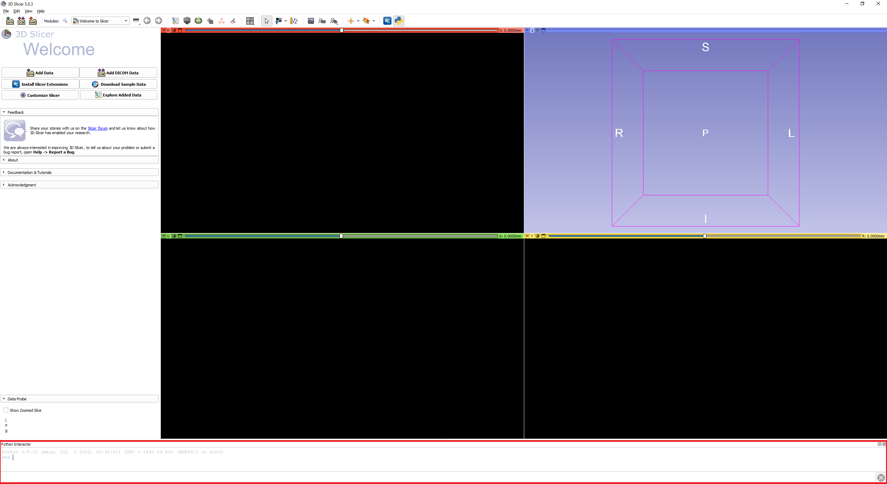

# 3DSlicer-Python
Python automated 3D slicer pipeline to convert different image modalities to DL ready image data


## Table of contents

* [Inputs](#inputs)
* [Running-code](#run-code)
* [Dependencies](#dependencies)

## Inputs
```#Put your Images here```  

📂📜📦 

📦**ParentDir**
  ┣  📂**Reference**
&ensp; &ensp;    ┣ 📜Atlas.nrrd
&ensp; &ensp;    ┗ 📜ROI_Atlas.mrk.json
  ┣  📂**ImageModality1**  
&ensp; &ensp;    ┣ 📜Case1.nii.gz  
&ensp; &ensp;    ┣ 📜Case2.nii.gz   
&ensp; &ensp;    ┣ 📜Case3.nii.gz  
&ensp; &ensp;    ┗ ...    
  ┣ 📂**ImageModality2**  
&ensp; &ensp;    ┣ 📜Case1.nii.gz  
&ensp; &ensp;    ┣ 📜Case2.nii.gz   
&ensp; &ensp;    ┗ 📜Case3.nii.gz  
&ensp; &ensp;    ┗ ...    
  ┗ 📂**Mask1**  
&ensp; &ensp;    ┣ 📜Case1.nii.gz  
&ensp; &ensp;    ┣ 📜Case2.nii.gz   
&ensp; &ensp;    ┣ 📜Case3.nii.gz  
&ensp; &ensp;    ┗ ...   
## Running-code
- Locate the python icon in your slicer GUI.

- It should open up a python consol at the bottom of the screen like this,

- Execute the python script using command : ``` exec(open(r"D:\folder1/folder2/slicer_python_processing_code.py").read()) ```

## Dependencies
The python codes were tested and implemented on ```3D slicer 5.0.3 (r30893/7ea0f43)```. You can access older versions of 3D slicer [here](https://slicer-packages.kitware.com/#collection/5f4474d0e1d8c75dfc70547e/folder/5f4474d0e1d8c75dfc705482).