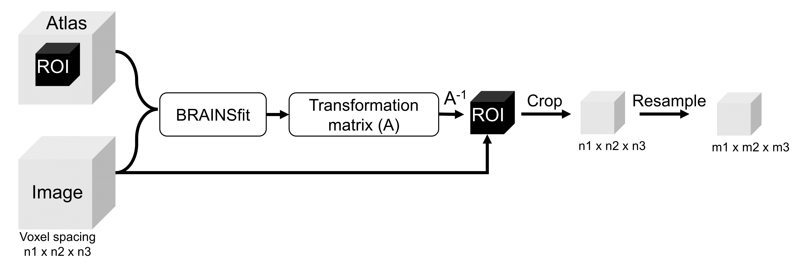

# 3DSlicer-Python
Python automated 3D slicer pipeline to convert different image modalities to DL ready image data. 

## Table of contents
* [Scripts](#scripts)
* [Running-code](#runcode)
* [Inputs](#inputs)
* [Outputs](#outputs)
* [Dependencies](#dependencies)
* [Useful-links](#links)
* [How-to-cite](#cite)
* [Wiki-FAQs](#Wiki)

## Scripts
The repository includes below mentioned python scripts for various image operations. 
  - BRAINSFit registration and crop using Brain Atlas
  - N4ITK MRI Bias Correction 
  - Resample and crop two image modalities (smaller and larger volume extent)
  - Additional scripts can be found at [Wiki and FAQs!](https://github.com/munjalshah94/3DSlicer-Python/blob/main/Documentation/Wiki.md)
 ### Example scripts
📜 [Volume_registration_crop_atlas.py](https://github.com/munjalshah94/3DSlicer-Python/blob/main/Brainsfit_Atlas/Volume_registration_crop_atlas.py)

Registration of volume node ona reference Atlas image using [BRAINSFit algorithm](https://slicer.readthedocs.io/en/latest/user_guide/modules/brainsfit.html). The reference atlas used in the code can be found [here](https://www.ncbi.nlm.nih.gov/pmc/articles/PMC7274757/). Firstly, a transformation matrix is calculated to map image onto Atlas. The inverse of transformation matrix is used to map ROI (extracted based on Atlas) onto the image. The image is cropped and resampled from voxel spacing of n1xn2xn3 to m1xm2xm3.  Options for BRAINSfit algorithm and resampling can be found at the beginning of the code.
  
  
📜 [N4ITKbias.py](https://github.com/munjalshah94/3DSlicer-Python/blob/main/N4ITKBias/N4ITKbias.py)

Performs batch image bias correction using N4 algorithm. 

📜 [Resample_crop_Two_modalities_segmentations.py](https://github.com/munjalshah94/3DSlicer-Python/blob/main/Two_Modalities/Resample_crop_Two_modalities_segmentations.py)

Executes batch resampling and cropping between two image modalities of same pateint or case. The code can be used in the the scenario of mutiple image modalities were present (diseases like ICAD and Aneurysm) with different volume extent. The volumes are cropped based on smaller volume extent and resample based on given image modality.

## Running-code
- Locate the python icon in your slicer GUI.
- It should open up a python consol at the bottom of the screen.
- Execute the python script using command : ``` exec(open(r"D:\folder1/folder2/slicer_python_processing_code.py").read()) ```


## Inputs
The python code is tested on given formats: ```.nrrd, .nii, .nii.gz, .seg.nrrd ```. However, It should work on any volume node that can be imported via [```slicer.util.loadVolume```](https://slicer.readthedocs.io/en/v4.11/developer_guide/slicer.html?highlight=util.loadVolume#slicer.util.loadVolume). More information on python scripting commands can be found at [3D slicer Docs](https://slicer.readthedocs.io/en/v4.11/index.html). 

📦**Parent Directory**          &emsp; &emsp;  
  ┣ 📂**Reference**  
&ensp; &ensp;    ┣ 📜*Atlas.nrrd*  
&ensp; &ensp;    ┗ 📜*ROI_atlas.mrk.json*  
  ┣ 📂**Original**  
  &ensp; &ensp;    ┣ 📂case1                     
  &ensp; &ensp; ┃ &nbsp;    ┣ 📜ImageModality1.nii.gz  
  &ensp; &ensp; ┃ &nbsp;    ┣ 📜ImageModality2.nrrd  
  &ensp; &ensp; ┃ &nbsp;    ┗ 📜mask.seg.nrrd  
  &ensp; &ensp;    ┣ 📂case2                     
  &ensp; &ensp; ┃ &nbsp;    ┣ 📜ImageModality1.nii.gz  
  &ensp; &ensp; ┃ &nbsp;    ┣ 📜ImageModality2.nrrd  
  &ensp; &ensp; ┃ &nbsp;    ┗ 📜mask.seg.nrrd  
  &ensp; &ensp; ┗ ...                             
  
## Outputs
- The code will output the image or mask with any extension supported by 3D slicer under [```slicer.util.saveNode```](https://slicer.readthedocs.io/en/latest/developer_guide/slicer.html#slicer.util.saveNode)
- The outputs will be sorted based on image modalities provided by user in the config file. Output folders will be created based on image modalities inputs given by user.
 
📦**Output Directory**          &emsp; &emsp;  
  ┣ 📂**ImageModality1_out**  
  &ensp; &ensp;    ┣ 📜Case1.nii.gz  
  &ensp; &ensp;    ┣ 📜Case2.nii.gz   
  &ensp; &ensp;    ┣ 📜Case3.nii.gz  
  &ensp; &ensp;    ┗ ...  
  ┣ 📂**ImageModality2_out**  
  &ensp; &ensp;    ┣ 📜Case1.nrrd  
  &ensp; &ensp;    ┣ 📜Case2.nrrd   
  &ensp; &ensp;    ┣ 📜Case3.nrrd  
  &ensp; &ensp;    ┗ ...    
  ┗ 📂**Mask_out**  
  &ensp; &ensp;    ┣ 📜Case1.nii.gz  
  &ensp; &ensp;    ┣ 📜Case2.nii.gz   
  &ensp; &ensp;    ┣ 📜Case3.nii.gz  
  &ensp; &ensp;    ┗ ... 


## Dependencies
The python codes were tested and implemented on ```3D slicer 5.0.3 (r30893/7ea0f43)```. You can access older versions of 3D slicer [here](https://slicer-packages.kitware.com/#collection/5f4474d0e1d8c75dfc70547e/folder/5f4474d0e1d8c75dfc705482).

## Useful-links
- [Forum](https://discourse.slicer.org/) and  [Python](https://discourse.slicer.org/tag/python) related posts
- [API](https://slicer.readthedocs.io/en/latest/developer_guide/slicer.html) ```slicer.util and slicer.logic``` are most frequently used for volume operations. 
- [Script-repository](https://slicer.readthedocs.io/en/latest/developer_guide/script_repository.html)
## How-to-cite
-  Tatsat Patel, Aakash Patel, Sricharan S. Veeturi,  Munjal Shah,Muhammad Waqas, Andre Monteiro, Ammad A. Baig, Nandor Pinter, Elad I. Levy, Adnan H. Siddiqui, and Vincent M. Tutino, "Evaluating a 3D deep learning pipeline for cerebral vessel and intracranial aneurysm segmentation from computed tomography angiography–digital subtraction angiography image pairs" World Neurosurgery (2023).
- Tatsat Patel, Munjal Shah, Sricharan S. Veeturi, Andre Monteiro, Adnan H. Siddiqui, and Vincent M. Tutino. "Effect of Inter-User Segmentation Differences on Ischemic Stroke Radiomics from CTA and NCCT." In 2022 IEEE Western New York Image and Signal Processing Workshop (WNYISPW), pp. 1-5. IEEE, 2022. [Link](https://ieeexplore.ieee.org/abstract/document/9983487)
## Wiki-FAQs
Additonal codes, tips and tricks can be found here in our repo!! [Wiki and FAQs!](https://github.com/munjalshah94/3DSlicer-Python/blob/main/Documentation/Wiki.md)

## Keywords
3D Slicer, Python scripting, Region Of Interest (ROI), Volume cropping, Resample image, MRI Bias correction
